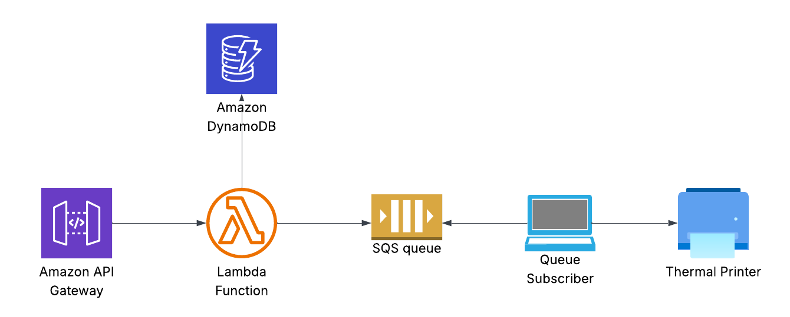

# Conference Participant Registration & Display System

A serverless web application built for a live conference ([Fii IT-ist](https://fii-itist.asii.ro/)), enabling real-time participant registration with an engaging visual display. The system collects participant information through a web form and displays registered names on a dynamic "wall of fame" that updates in real-time during the event.

## Key Features

- **User Registration Form**: Clean, mobile-responsive interface for attendees to submit their names
- **Dynamic Results Display**: Kahoot-style animated wall of fame with real-time updates
- **Real-time Polling**: Results page auto-refreshes every 5 seconds to show new participants
- **Data Collection**: Captures participant name, phone model (via User-Agent parsing), and IP address
- **Serverless Architecture**: Fully scalable AWS infrastructure with zero server management
- **Dual Storage**: SQS queue for event processing + DynamoDB for persistent storage

## Architecture



Built using AWS Serverless technologies:

- **AWS Lambda** (Python 3.12): Request routing and business logic
- **API Gateway**: RESTful API endpoints
- **Amazon SQS**: Message queue for asynchronous event processing
- **Amazon DynamoDB**: NoSQL database for participant data storage
- **AWS SAM**: Infrastructure as Code for deployment

## API Endpoints

| Method | Endpoint   | Description                                    |
| ------ | ---------- | ---------------------------------------------- |
| `GET`  | `/`        | Displays participant registration form         |
| `POST` | `/form`    | Processes form submission, queues data to SQS  |
| `GET`  | `/results` | Shows animated wall of registered participants |

## Deployment

### Build and Deploy

```bash
# Build the application
sam build --use-container

# Deploy with guided configuration
sam deploy --guided
```

### Local Development

Run the API locally for testing:

```bash
# Start local API server
sam local start-api

# Access endpoints
curl http://localhost:3000/
```
